# Milestone 1 — Initial Access

## Objective

The objective of Milestone 1 was to perform reconnaissance against the authorized target, identify exposed application entry points, assess the patient portal authentication mechanism, and obtain controlled access to the restricted patient-report area.

**Target:** `https://medirozahospital.com`

**Assessment type:** Authorized black-box web application security assessment.

---

## 1. Initial Reconnaissance

### DNS Enumeration — NSLookup

The target domain was first resolved to identify its associated IP address.

```bash
nslookup medirozahospital.com
```

**Result:**

```text
199.188.201.16
```

The domain was confirmed to resolve to the target IP address.

**Evidence:**

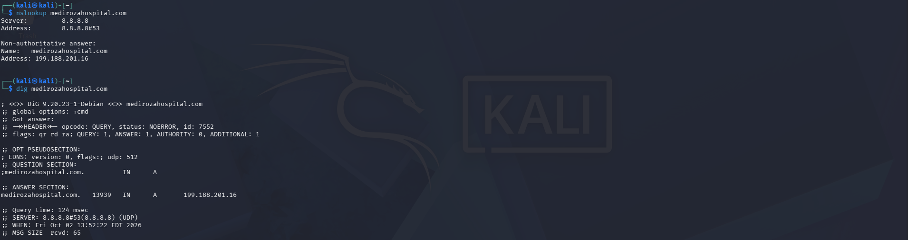

---

### Web Technology Identification — WhatWeb

WhatWeb was used to identify technologies and server information exposed by the target.

```bash
whatweb -v https://medirozahospital.com
```

The scan identified information including:

* LiteSpeed web server
* HTML5
* Target IP address
* LiteSpeed-related technology indicators

The root request also returned a `403 Forbidden` response under the tested conditions.

### WAF Detection — Wafw00f

Wafw00f was used to identify web application firewall/protection technology.

```bash
wafw00f https://medirozahospital.com -v
```

The assessment identified LiteSpeed-related web protection.

**Observation:** The presence of web-server protection did not prevent authorized application-level testing.

**Evidence:**
📸 `images/M1-03-wafw00f.png`
**Evidence:**
📸 `images/M1-02-whatweb.png`


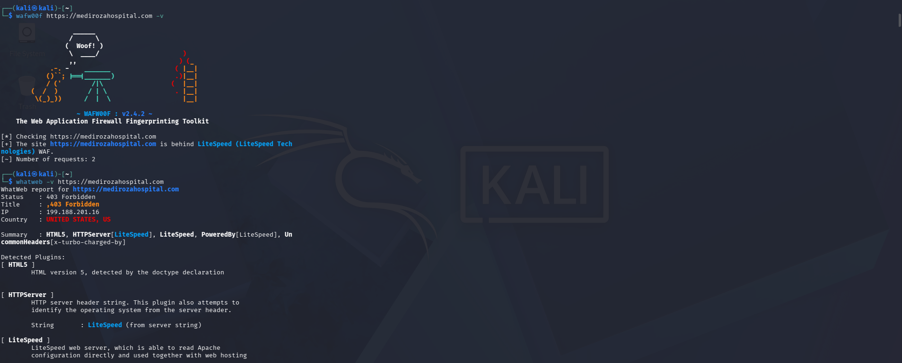

---
# 2. Patient Portal Discovery

Further enumeration identified the patient application directory:

```text
https://medirozahospital.com/patient/
```

The directory listing exposed several application resources, including:

```text
reports/
download.php
login.php
logout.php
portal.php
```

The discovery of `login.php`, `portal.php`, `download.php`, and `reports/` provided a clear path for further authentication and access-control testing.

**Evidence:**
📸 `images/M1-04-patient-directory.png`

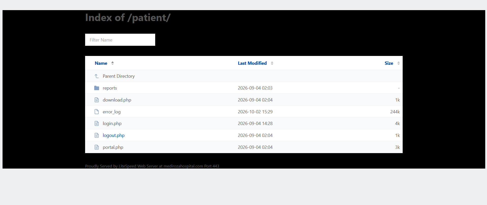

---

## 3. Patient Portal Authentication

The patient portal was identified at:

```text
https://medirozahospital.com/patient/portal.php
```

Direct access without authentication redirected the request to:

```text
login.php
```

This established that the portal was protected by an authentication mechanism.

The login page accepted:

* Username
* Password

The authentication functionality was therefore selected for controlled input-validation testing.

**Evidence:**

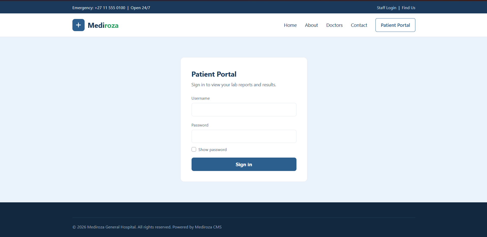

---

# 4. SQL Injection Testing

A controlled single-quote test was submitted through the username parameter:

```bash
curl -i -c test-sqli-cookie.txt \
-d "username=%27&password=test" \
https://medirozahospital.com/patient/login.php
```

The application returned a MySQL syntax error generated by `mysqli_query()`.

This demonstrated that user-controlled input was reaching the SQL query without adequate parameterization.

**Finding:** SQL Injection vulnerability identified.

**Evidence:**

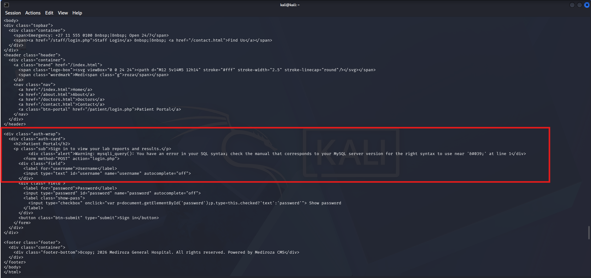

---

# 5. Authentication Bypass

The SQL injection vulnerability was subsequently validated using the authorized laboratory test input:

```text
Username: admin' --
Password: test123
```

The login request returned:

```text
HTTP/2 302
location: portal.php
```

The server also issued a new PHP session cookie.

The `302` redirect to `portal.php` indicated that the authentication request had been accepted and an authenticated session had been established.

**Evidence:**

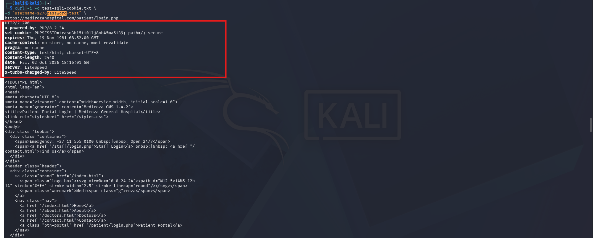

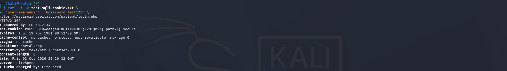

> **Security note:** Session identifiers should be redacted before publishing the screenshot.

---

# 6. Successful Patient Portal Access

The authenticated session was then used to access:

```text
https://medirozahospital.com/patient/portal.php
```

The server returned:

```text
HTTP/2 200
```

and the page displayed:

```text
My Reports
```

This confirmed successful access to the restricted patient portal.

The portal contained three encrypted laboratory reports.

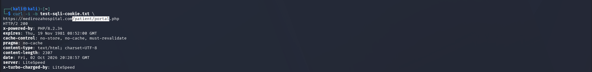

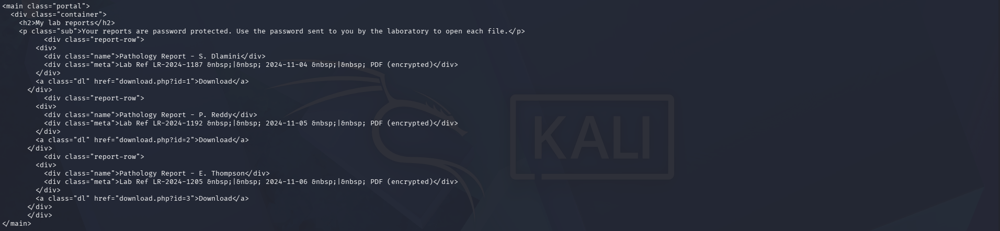

# 7. Laboratory Reports Identified

The authenticated portal displayed three laboratory reports, each identified as a password-protected/encrypted PDF.

The portal provided download functionality for the reports.

> Patient names, laboratory reference numbers, medical information, and other sensitive information should be redacted before uploading this screenshot to a public repository.

The actual confidential PDF files are **not included in this public repository**.


**Evidence:**

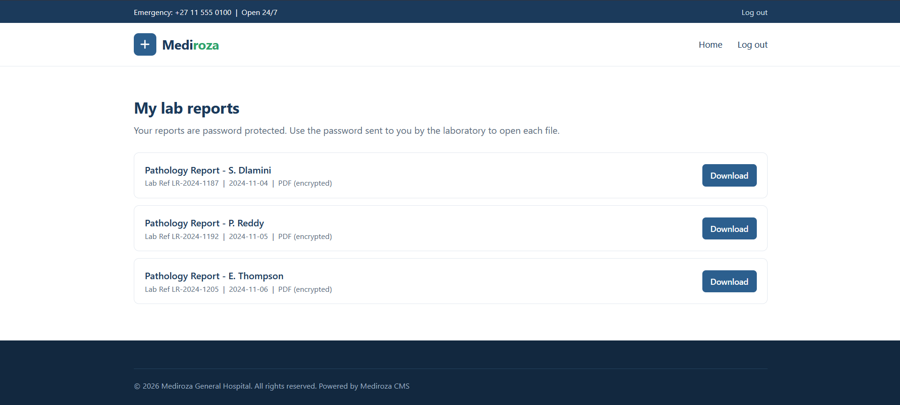

---

# 8. Attack Path

The Milestone 1 attack path can be summarized as:

```text
DNS Reconnaissance
        ↓
Web Technology / WAF Identification
        ↓
Patient Directory Discovery
        ↓
Patient Login Discovery
        ↓
SQL Injection Identified
        ↓
Authentication Bypass
        ↓
Authenticated Patient Portal Access
        ↓
Three Encrypted Laboratory Reports Identified
```

---

# 9. Finding Summary

| Finding                            | Evidence                | Status     |
| ---------------------------------- | ----------------------- | ---------- |
| Web technology disclosure          | WhatWeb / Wafw00f       | Identified |
| Patient directory listing          | `/patient/`             | Confirmed  |
| SQL Injection                      | SQL syntax error        | Confirmed  |
| Authentication bypass              | `302 → portal.php`      | Confirmed  |
| Restricted portal access           | `HTTP 200` / My Reports | Confirmed  |
| Three encrypted reports accessible | Portal evidence         | Confirmed  |

---

# 10. Impact

The SQL injection vulnerability allowed the application's authentication mechanism to be bypassed without knowing the legitimate password associated with the account used in the test.

Successful authentication provided access to the restricted patient portal and its laboratory-report functionality.

In a real healthcare environment, a vulnerability of this nature could potentially result in unauthorized access to confidential patient information.

---

# 11. Remediation

The primary recommendations are:

* Use parameterized/prepared SQL statements.
* Never concatenate user-controlled input directly into SQL queries.
* Use secure password hashing and verification.
* Implement server-side authorization checks for every protected resource.
* Disable unnecessary directory listing.
* Use generic authentication error messages.
* Protect sensitive files and application logs from direct public access.
* Implement appropriate session security and authentication rate limiting.

---

## Milestone 1 Conclusion

Milestone 1 successfully demonstrated an authentication weakness in the authorized target application.

Reconnaissance led to the discovery of the patient portal, controlled testing identified SQL injection, and the vulnerability was subsequently validated through a successful authentication bypass.

The resulting authenticated session provided access to the patient portal, where three encrypted laboratory reports required by the laboratory exercise were identified.

This established the basis for **Milestone 2 — PDF Encryption Analysis**.


#    Milestone 2 — PDF Encryption & Password Recovery

## Objective

The objective of Milestone 2 was to analyze and recover the passwords protecting the three PDF laboratory reports obtained during Milestone 1.

**Written permission:** Granted as part of the Network Walks laboratory exercise.

All three reports were successfully downloaded from the authenticated patient portal.

---

## 1. Obtaining the Reports

Following the successful authentication bypass documented in Milestone 1, the authenticated patient portal provided access to three encrypted PDF reports.

The three files were downloaded for the password-recovery exercise.

📸 **Evidence:** `images/M2-01-three-pdfs.png`

---

## 2. Hash Extraction & Password Recovery

The Network Walks **Hash Calculator** and **Password Cracker** tools were used to process the encrypted PDF files.

Workflow:

```text
Encrypted PDF
     ↓
Hash extraction
     ↓
Password-cracking tool
     ↓
Wordlist testing
     ↓
Password recovered
     ↓
PDF contents accessed
```

The three reports were individually hashed and tested against available password candidates.

---

## 3. Report 1

The hash for Report 1 was generated using the Network Walks Hash Calculator and subsequently submitted to the Network Walks Password Cracker.

The password was successfully recovered:

```text
123456
```

📸 **Evidence:**

* `images/M2-02-report1-hash.png`
* `images/M2-03-report1-cracked.png`

The recovered password was then used to successfully open the encrypted PDF.

---

## 4. Report 2

Report 2 was processed using the same general workflow.

The password was successfully recovered:

```text
password
```

The recovered password was then used to access the encrypted PDF.

📸 **Evidence:**

* `images/M2-04-report2-hash.png`
* `images/M2-05-report2-cracked.png`

---

## 5. Report 3

Report 3 required a different approach.

The Network Walks Password Cracker initially failed to recover the password because its available wordlist was limited to approximately **100 candidate words**.

The recovered password was:

```text
!@#$%^&
```

### Wordlist Testing

Several approaches were attempted:

| Attempt | Wordlist / Method                      | Result                                    |
| ------- | -------------------------------------- | ----------------------------------------- |
| 1       | Network Walks default password cracker | Failed                                    |
| 2       | `rockyou.txt`                          | Not practical for the available tool/size |
| 3       | `fasttrack.txt`                        | Failed                                    |
| 4       | Nmap-related wordlist                  | Failed                                    |
| 5       | John the Ripper default password list  | **Successful**                            |

The successful approach used the John the Ripper password list and recovered:

```text
!@#$%^&
```

📸 **Evidence:**

* `images/M2-06-report3-hash.png`
* `images/M2-07-report3-wordlist-tests.png`
* `images/M2-08-report3-jtr-success.png`

---

## 6. Results

| Report   | Password   | Recovery Result        |
| -------- | ---------- | ---------------------- |
| Report 1 | `123456`   | Successfully recovered |
| Report 2 | `password` | Successfully recovered |
| Report 3 | `!@#$%^&`  | Successfully recovered |

All three encrypted PDFs were successfully opened after recovering their passwords.

---

## 7. Key Observation

The exercise demonstrated that password recovery success depends heavily on the quality and coverage of the wordlist being tested.

The Network Walks Password Cracker successfully recovered the first two passwords using its available candidate list. However, the third password consisted entirely of special characters and was not present within the tool's limited candidate list.

Alternative wordlists were therefore tested before John the Ripper's available password list successfully recovered the third password.

This demonstrated why password-recovery exercises may require different tools and wordlists rather than relying on a single approach.

---

## 8. Evidence

The following screenshots document the Milestone 2 process:

```text
images/
├── M2-01-three-pdfs.png
├── M2-02-report1-hash.png
├── M2-03-report1-cracked.png
├── M2-04-report2-hash.png
├── M2-05-report2-cracked.png
├── M2-06-report3-hash.png
├── M2-07-report3-wordlist-tests.png
└── M2-08-report3-jtr-success.png
```

> **Privacy:** The actual PDF files and confidential medical information are not included in the public repository. Screenshots should be redacted before publication.

---

## Milestone 2 Conclusion

All three encrypted laboratory-report PDFs were successfully processed and their passwords recovered.

Reports 1 and 2 were recovered using the Network Walks hashing and password-cracking workflow. Report 3 required additional wordlist testing before John the Ripper successfully recovered its password.

This completed the Milestone 2 requirement:

> **Recovered contents of all three files with proof of successful access.**


# M3 — Critical Data Exposure

**Target:** `medirozahospital.com`
**Assessment:** Authorized Network Walks Lab
**Objective:** Identify exposed employee salary and shareholder information.

## 1. Discovery

During analysis of previously discovered information, `robots.txt` revealed:

```text
Disallow: /old/
```

Investigation of this legacy directory revealed an exposed database backup:

```text
/old/mediroza_db_backup_2019.sql
```
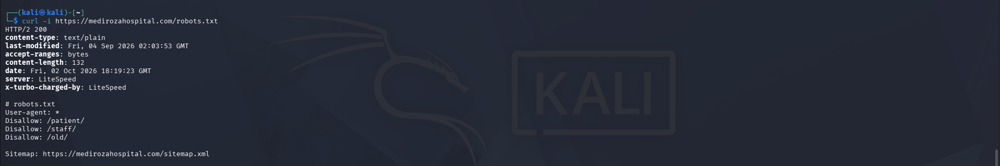

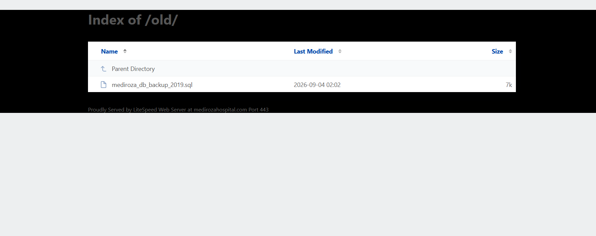

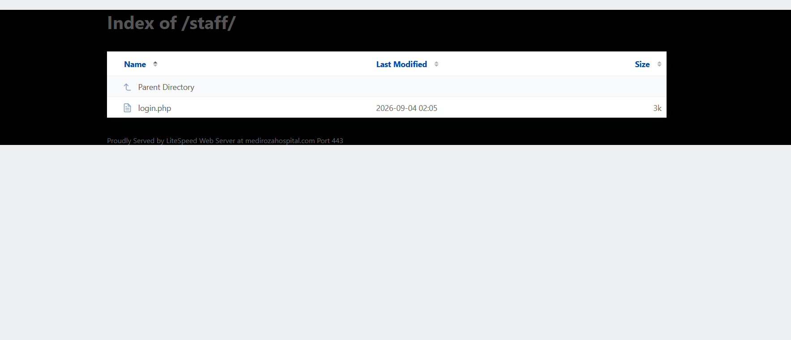
The file identified itself as an internal Mediroza HR database backup containing confidential staff and shareholder records.

## 2. Critical Findings

### Employee Salary Exposure

The `staff` table contained employee information including:

```text
full_name
job_title
department
email
phone
national_id
monthly_salary_zar
date_joined
```

The `monthly_salary_zar` field exposed salary information for hospital employees.

**Evidence:** `images/M3-01-employee-salaries.png`
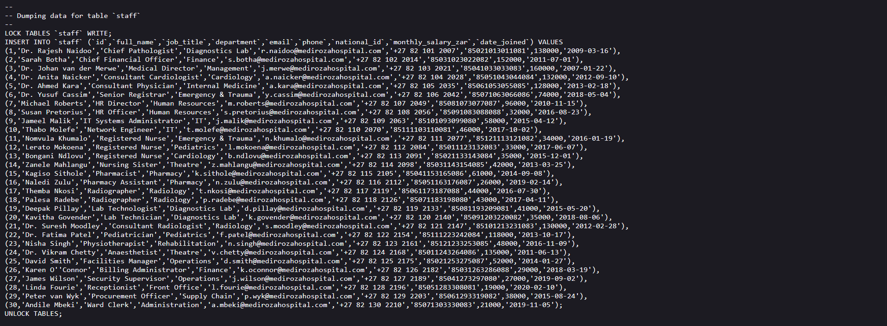

### Shareholder Information Exposure

The `shareholders` table contained:

```text
shareholder_name
share_percent
shares_held
share_class
```

This exposed historical shareholder identities and ownership information.

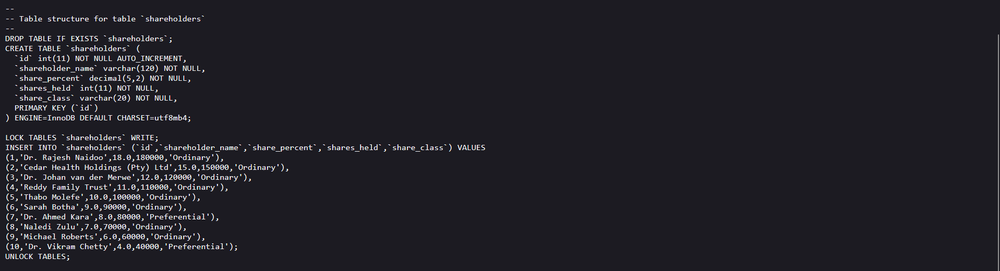

> Sensitive names, contact information, National IDs, salaries, and ownership values have been redacted from the public repository.

## 3. Exposure Chain

```text
robots.txt
    ↓
/old/
    ↓
mediroza_db_backup_2019.sql
    ↓
staff → Employee salary information
shareholders → Ownership information
```

## 4. Impact

The exposed backup disclosed sensitive historical HR and ownership information and could enable:

* Employee privacy violations
* Salary disclosure
* Exposure of personal information
* Disclosure of ownership information
* Targeted phishing/social engineering

The backup was dated **2019-08-27**, so the findings represent exposure of historical records and should not automatically be considered current.

## 5. Recommendations

* Remove database backups from the public web root.
* Store backups outside web-accessible directories.
* Remove unnecessary legacy files and directories.
* Disable directory listing where not required.
* Apply strict access controls to sensitive HR and ownership data.
* Regularly scan production servers for exposed backup and temporary files.

## Conclusion

The M3 investigation identified a publicly accessible historical database backup containing confidential employee and shareholder information. The required salary and shareholder data exposures were confirmed and documented with screenshots.

**Skills:** Web reconnaissance • Information disclosure • Database analysis • Sensitive data identification • Evidence collection • Security reporting
